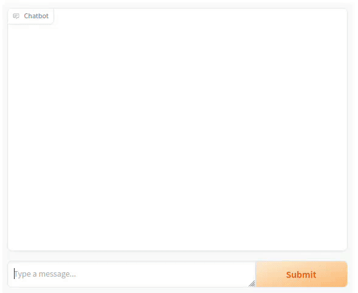

# Not-so-simple phi-2 chatbot

This project implements a simple chatbot using [`microsoft/phi-2`](https://huggingface.co/microsoft/phi-2) model.
The goal is to create a chatbot that can classify the user input into three classes (`support`, `comercial` and `joke`) and respond accordingly using the right prompts. It uses a different prompt template depending on the classification output.

Here you can see a GIF showcasing a short conversation.



## Quickstart

If you want to quickly run the code, you have three options:

1. The easiest way is to [run `Not-so-simple phi-2 chatbot` notebook on colab](https://colab.research.google.com/drive/1rL1AwD3JCHt_OsvVd9zMQ1LT8L6cOOtH?usp=sharing)
2. Download the code and run `not_so_simple_phi2_chatbot.ipynb` notebook (you need to install `requirements.txt`)
3. Download the code and run `gradio app.py` (you need to install `requirements.txt`)

> ⚠️ **Warning:** Inference is much fastar on GPU than on CPU.

## Approach

Broadly speaking, the solution to this problem was to:

1. Take the input query from the user (`human_input`) and classify it into one of the three categories
2. Define a different instruction set (`instructions`) depending on the classification result
3. Retrieve the history of past chats (`chat_history`)
4. Put everything together in a template like the one below.

```text
You are a chatbot having a conversation with a human. \
Follow the given instructions to reply to the Human message below.

Instructions:{instructions}

{chat_history}
Human: {human_input}
Chatbot:
```

In this way, the chatbot could not only follow the conversation between it and the human, but also get specific instructions on how to behave depending on the topic of the conversation.

## How it was done

> This project is a continuation of [Simple phi-2 chatbot](https://github.com/gnuevo/simple-phi-2-chatbot/tree/master) so check there for the basic info on how it was done.

This chatbot demo was done in the following steps:

## Find the right text classifier

As we need to classify our input sentence into one of three categories

+ `support`
+ `sales`
+ `joke`

the first thing to do is to find a suitable text classifier. We opted for a 0-shot learning classifier because we have no samples from any of the categories. After some exploration and after trying several [0-shot classifiers from the Model Hub](https://huggingface.co/models?pipeline_tag=zero-shot-classification&sort=trending) we reached the conclusion that `phi-2` was also the best model for classification. You can see the different experiments and results in `experiments.ipynb`.

## Experiment with `langchain`

After having ready our classifier, the next step was to get a sense of how we could use `langchain` to complete the project. In `experiments_langchain.ipynb` you can see the differet steps we took in order to get from the user message, to a complete chat-like prompt with the following parts like the one shown above.

## Adapt chain to work in streaming mode

Finally, to make use of the `langchain` chain in streaming mode (so that we get the effect of writing the text word by word, instead of a big chunk at a time), we had to break the chain into two parts. The first half is in charge of the classification of the text, and composing the full prompt we'll use. The second part is the call to the language model in streaming mode.

## Adapt the code for different run configurations

Finally, the code was adapted to run on different configurations: using gradio command, on a local jupyter notebook or on Google Colab.
Check the [Quickstart](#quickstart) section.

## Considerations and limitations

+ Appart from language models, `langchain` offers [ChatModel](https://python.langchain.com/docs/modules/model_io/chat/)s as well. The difference between the two comes to the level of abstraction. While standard language models work in a text-in/text-out basis; ChatModels work with the concept of "chat messages". However, they were not considered to be necessary for this project because the task at hand is simple enough and does't necessarily need for an extra level of abstraction.
+ As explained in [Adapt chain to work in streaming mode](#adapt-chain-to-work-in-streaming-mode), we split the chain in two parts to implement the streaming mode. We weren't capable of allowing streaming mode using a full chain instead. We followed instructions from [this forum](https://github.com/langchain-ai/langchain/issues/2918) but with no luck. We believe there has to be a way to implement streaming within a chain. However, it may not be implemented yet, as we can see [here](https://python.langchain.com/docs/integrations/llms/#features-natively-supported) (mind that the `HuggingFacePipeline` object suggested in the forum appears not to have streaming capabilities). Anyway, the solution splitting the chain was quick, and working; and so it wasn't justified to keep searching for a better solution.
+ There is a chat interface build by the HuggingFace team called [ChatUI](https://github.com/huggingface/chat-ui). It's visually very appealing, but it had two limitations regarding this project.
    + It was more complex to use and to setup than `gradio.ChatInterface()`.
    + It did not use Gradio, it's a [SvelteKitt app](https://kit.svelte.dev/) (mind that we're instructed to use `gradio`).
+ We make the classification of the text based solely on the last message of the user. This can lead to some missclassification issues. For example, it may think we're joking when we provide some numerical data. This makes sense because the classifier does not have access to the full context. Although this could be a nice-to-have improvement, our focus now is on other requirements.
+ Ensure security and appropriate responses. There is no security mechanism in place to protect against attacks like _prompt injection_. We do not ensure responses generated by the model are harmless and appropriate either. This could be interesting for a production project not only to ensure the chatbot responds politely (it does not give rude or discriminatory responses, for example) and/or adapts the tone when talking to users (for example with a very angry customer).
